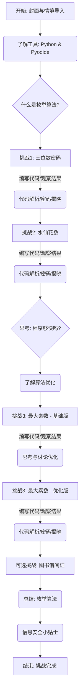

# Slidev 课件项目计划：Python 枚举算法的应用 - “密室大逃脱”

## 一、课件主题与目标 (共约 20 页)

*   **主题：** 通过“密室大逃脱”的趣味情境，学习并应用 Python 枚举算法解决实际问题。
*   **核心目标：**
    *   学生能够理解枚举算法的基本思想（“全部列举，逐个检验”）。
    *   学生能够使用 Python 编程，通过枚举算法解决简单的密码破解类问题。
    *   学生能够初步体会算法优化的概念和必要性。
    *   学生能够通过 `pyodide` 在网页上运行和调试 Python 代码。
*   **风格：** 以互动和实践为主，理论知识点到即止。

## 二、学生学习路径 (Mermaid 流程图)



## 三、课件内容规划 (按页)

---
layout: cover
---

**第 1 页：封面**
*   标题：密室大逃脱 - Python 枚举算法大冒险！
*   副标题：你能用代码找到逃出密室的钥匙吗？
*   （设计一些与密码、钥匙、迷宫相关的视觉元素）

---

**第 2 页：故事开始！**
*   引入“密室大逃脱”情境。
*   “同学们，欢迎来到由学校科技社团设计的智能密码锁密室！你们被分成了几个小组，分别困在了不同的密室中。只有找到正确的密码，才能成功逃脱！”
*   （配上密室或问号的图片）

---

**第 3 页：我们的工具 - Python 与 Pyodide**
*   简单介绍我们今天将使用的“魔法工具”：Python 语言。
*   引出 `pyodide`：“更酷的是，我们今天可以直接在网页上运行 Python 代码，立刻看到结果！”
*   展示一个极简的 `pyodide` 运行 Python `print("Hello, World!")` 的示例。
    *   *交互点：* 提供一个可编辑的 `pyodide` 代码框，让学生尝试修改并运行。

---

**第 4 页：什么是枚举算法？(点到即止)**
*   “要破解密码，一种简单直接的方法就是——把所有可能的密码都试一遍！这种‘笨办法’在编程里叫做**枚举算法**。”
*   核心思想：**全部列举，逐个检验**。
*   （用一个简单的生活例子比喻，比如在一串钥匙中找正确的钥匙）

---
layout: two-cols
---

**第 5 页：第一个挑战：三位数密码**
*   **左侧：题目描述**
    *   “第一个密室的密码是一个三位数的数字组合 (000-999)。”
    *   线索1：密码各位数字之和为 12。
    *   线索2：最高位数字是中间位的两倍。
    *   线索3：密码是满足条件的最大数值。
*   **右侧：手动试试看？**
    *   “在用代码之前，我们先手动推算一下，有哪些可能的密码呢？”
    *   *互动点：* 引导学生思考，可以给出一些提示或选项。

---

**第 6 页：用 Python 来枚举！(游戏1)**
*   引入第一个小游戏界面（类似 [`资料/game1.vue`](资料/game1.vue:0)）。
*   “手动太慢啦！让我们用 Python 来帮我们尝试所有三位数。”
*   提供基础的 Python 代码框架：
    ```python
    # 如何表示一个三位数？
    # 如何逐个尝试000到999？
    for i in range(1000):
        # 如何把数字 i 变成百位、十位、个位？
        # ...
        # 如何判断是否符合线索？
        # ...
        print(i) # 打印出所有尝试的数字
    ```
*   *交互点：* 学生在 `pyodide` 编辑器中补充代码，运行并观察密码锁的变化。

---

**第 7 页：游戏1 - 代码解析与密码揭晓**
*   展示解决第一个密码问题的完整 Python 参考代码。
*   逐步讲解代码的关键部分：如何分解数字，如何根据线索进行判断。
*   “看看我们的程序找到了多少个可能的密码？最终的正确密码是哪个？”
*   （密码锁动画展示破解过程，最终停在正确密码上）

---

**第 8 页：第二个挑战：神秘的水仙花数**
*   引入“水仙花数”的概念。
*   “第二个密室的密码更加神秘，它是一个‘水仙花数’。什么是水仙花数呢？”
*   定义：“水仙花数”是指一个三位自然数，其各位数字的立方和等于该数本身。例如：153 = 1³ + 5³ + 3³。
*   问题：“请找出**最大**的那个水仙花数作为密码！”

---

**第 9 页：寻找水仙花数 (游戏2)**
*   提供第二个小游戏界面。
*   引导学生思考如何用枚举算法找出所有的三位水仙花数。
*   Python 代码提示：
    ```python
    for num in range(100, 1000): # 水仙花数是三位数
        # 分离百位、十位、个位
        # ...
        # 计算各位数字的立方和
        # ...
        # 判断是否等于 num 本身
        # ...
        # 如果是水仙花数，就 print 出来
        # ...
    # 别忘了，我们要找的是最大的那个哦！
    ```
*   *交互点：* 学生编写代码，运行并找到所有水仙花数，并确定最大的那个。

---

**第 10 页：游戏2 - 水仙花数的秘密**
*   展示寻找最大水仙花数的参考代码。
*   回顾枚举过程，强调如何找到“最大”的那个。
*   （密码锁动画展示破解过程）

---

**第 11 页：思考：我们的程序够快吗？**
*   “刚才我们破解了两个密码，程序帮我们尝试了很多可能性。但如果密码更复杂呢？”
*   引出问题：如果密码是6位数，从 000000 到 999999，我们的程序要试多少次？（一百万次！）
*   “一直傻傻地试下去，效率会不会太低了？”
*   （可以配一个计算机“汗流浃背”的卡通图）

---

**第 12 页：枚举算法的优化 (点到即止)**
*   “聪明的程序员会想办法让枚举更‘聪明’一些，这就是**算法优化**。”
*   简单介绍几种优化思路：
    *   **缩小枚举范围：** 有没有办法从一开始就少试一些明显不可能的？
    *   **改变枚举顺序：** 如果要找最大/最小的，从大到小或从小到大试会不会更快？
    *   **提前结束判断：** 一旦找到符合条件的，是不是可以不用再试了？（视情况而定）

---

**第 13 页：第三个挑战：寻找最大的三位数素数**
*   引入“素数”（质数）的概念。
*   “第三个密室的密码是一个三位数的素数，并且是其中**最大**的那个。”
*   回顾素数定义：只能被1和它本身整除的大于1的自然数。
*   思考：如何用枚举算法判断一个数是不是素数？如何找到最大的三位数素数？

---

**第 14 页：寻找最大素数 - 基础版 (游戏3)**
*   提供第三个小游戏界面。
*   引导学生先写一个基础版的枚举算法来寻找。
*   Python 代码提示（判断一个数 `n` 是否为素数）：
    ```python
    is_prime = True
    if n < 2:
        is_prime = False
    else:
        for i in range(2, n): # 从2到n-1检查是否有因子
            if n % i == 0:
                is_prime = False
                break # 找到一个因子就可以确定不是素数了
    # 如何找到999到100之间最大的那个素数？
    ```
*   *交互点：* 学生编写代码，运行并观察结果。可能会发现程序运行有点慢。

---

**第 15 页：游戏3 - 优化你的素数查找器！**
*   “刚才找素数是不是感觉有点慢？我们能优化一下吗？”
*   引导学生思考优化点：
    *   判断素数时，循环需要到 `n-1` 吗？其实到 `sqrt(n)` 就可以了。
    *   我们是要找最大的三位数素数，是不是可以从 999 开始往下找，找到第一个就是答案？
*   *交互点：* 学生修改代码，加入优化策略，再次运行，感受效率的提升。

---

**第 16 页：游戏3 - 优化后的代码与密码**
*   展示优化后的寻找最大三位数素数的参考代码。
*   对比优化前后的执行效率（可以通过 `pyodide` 粗略计时或观察执行次数）。
*   （密码锁动画展示破解过程）

---

**第 17 页：第四个挑战：图书借阅证之谜 (可选/思考题)**
*   “第四个密室的密码是一个五位数的图书借阅证编号。”
*   线索：个位数和十位数模糊不清，但知道这个五位数既是 44 的倍数，又是 56 的倍数。
*   “这个问题，你会如何用枚举算法解决呢？又有哪些可以优化的点？”
*   *互动点：* 开放性思考，学生可以讨论或在 `pyodide` 中尝试。此部分可以根据时间灵活调整。

---

**第 18 页：总结：枚举算法的力量与局限**
*   回顾本节课学习的枚举算法：
    *   核心思想：“全部列举，逐个检验”。
    *   优点：简单直接，容易理解和实现，能解决很多问题。
    *   缺点：当可能性太多时，效率较低，需要优化。
*   “枚举算法是我们编程工具箱里的一个基础但强大的工具！”

---

**第 19 页：信息安全小贴士**
*   从密码破解引申到信息安全。
*   “我们今天用枚举算法破解了密码。那么，如何设置一个更安全的密码，不容易被‘枚举’出来呢？”
*   引导学生思考：
    *   密码长度
    *   包含数字、字母（大小写）、特殊符号
    *   不要用生日、简单数字序列等容易被猜到的密码
*   *互动点：* 学生分享自己认为安全的密码设置策略。

---
layout: default
---

**第 20 页：挑战完成！你成功逃出密室！**
*   祝贺学生完成所有挑战。
*   “恭喜你，通过运用 Python 枚举算法，成功破解了所有密码，逃出了密室！”
*   （可以放一些庆祝的动画或图片）
*   “希望这次的编程冒险能让你感受到算法的乐趣！课后可以尝试解决实验报告中的拓展思考题哦！”

---